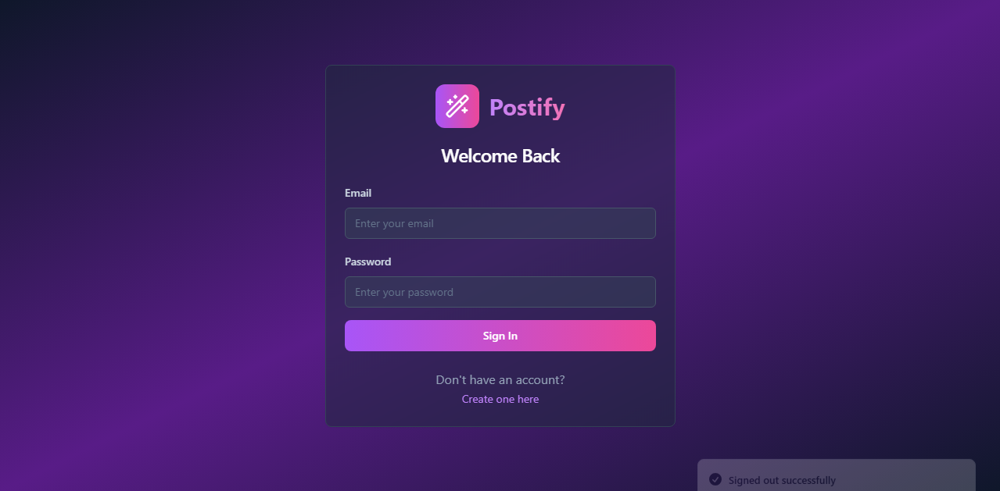

# 🎨 Postify — AI-Powered Poster Maker for Hustlers

**Postify** is a sleek AI web app that helps Kenyan hustlers, small businesses, and solopreneurs design stunning promotional posters in seconds — no design skills required.

Built with **GPT-4**, **DALL·E**, and **Supabase**, Postify transforms a simple promo idea into a downloadable, share-ready poster. From shop owners to side hustlers, anyone can create professional designs with just a few clicks.

🔗 **Live Demo** → [https://postify-kenyan-app.vercel.app](https://postify-kenyan-app.vercel.app)  
📂 **GitHub Repo** → [github.com/Mbitajeff/Postify-Kenyan-App](https://github.com/Mbitajeff/Postify-Kenyan-App)

---

## 📸 Demo



---

## 🚀 Features

- 📝 **AI Promo Text** – GPT-4 generates catchy, professional marketing lines.
- 🖼️ **AI Visuals** – DALL·E creates beautiful poster backgrounds.
- 🎨 **Theme Selector** – Vibrant, Minimal, or Bold options.
- 👁️ **Live Preview** – See your poster as you build it.
- ⬇️ **Download Option** – Instant download for use on social media or print.
- 💾 **Supabase Integration** – Posters are saved in real-time to the cloud.

---

## 💼 Built For

- Hairdressers & Barbers
- Food Vendors & Small Shops
- Tutors, Fundis & Freelancers
- Anyone with a product, a promo, and hustle energy

---

## 🤑 Monetization Model

- 💰 Pay-per-download (KES 50–100)
- 📦 Unlimited plan (KES 300/month)
- 🔜 Add-ons: Printing, SMS promos, WhatsApp distribution

---

## 🛠 Tech Stack

| Tech             | Purpose                        |
|------------------|--------------------------------|
| React + Tailwind | Frontend UI                    |
| GPT-4 (OpenAI)   | Marketing text generation      |
| DALL·E 3         | Poster image generation        |
| Supabase         | Poster storage + backend API   |
| Vercel           | Hosting + CI/CD                |

---

## 🌍 Why Postify?

Kenya has over **7.4M informal businesses**, most without access to design tools or professional designers.  
Postify gives them the power to create, promote, and grow — instantly and affordably.

---

## 📦 Getting Started Locally

```bash
git clone https://github.com/Mbitajeff/Postify-Kenyan-App.git
cd Postify-Kenyan-App
npm install
npm run dev
````

---

## 🧠 Environment Variables

Create a `.env` file in the root folder:

```env
SUPABASE_URL=https://supabase.com/dashboard/project/szzdfxetrydgnrnugvrh
```

---

## 🤝 Contributing

Pull requests welcome — help empower hustlers across Africa 🇰🇪💡
Fork it. Build it. Share it. Let’s grow this together.

---

## 👋 Author

Built with ❤️ by [Jeff Mbita](https://github.com/Mbitajeff)
🎯 For the Vibe Coding Hackathon 2.0 — *From Idea to Income*

---

## 📢 License

MIT — Free for personal & commercial use. Just give credit ✨

```

---

### ✅ Final Touch Checklist
